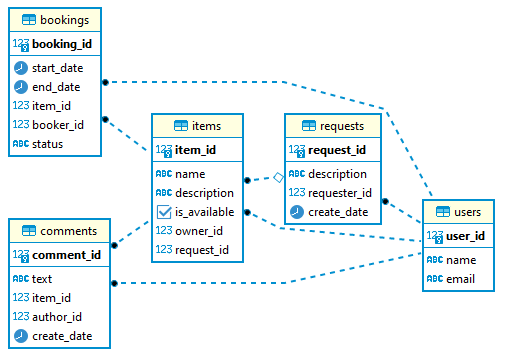

# Проект Share It

Технологии: Java 18, Spring Boot 3.4.5, WebFlux, Hibernate, PostgreSQL, Mockito, Maven, Docker

---

## Описание

Приложение для шеринга (от англ. share — «делиться») вещей, оно дает пользователям возможность
рассказывать какими вещами они готовы поделиться, находить нужную вещь и брать её в аренду на какое-то
время.

---

### Проект состоит из двух микросервисов:

1. Gateway - выполняет валидацию запросов и проксирует их в основной сервис. Запускается на порте 8080.

2. Server - содержит всю основную логику и работает с БД. Запускается на порте 9090. Позволяет пользователям:

* Добавлять и редактировать вещи. Изменять можно название, описание и статус доступа к аренде. Редактировать вещь может
  только её владелец.
* Просматривать информацию о конкретной вещи по её идентификатору. Информацию о вещи может просмотреть любой
  пользователь.
* Владелец может просматривать список всех своих вещей с указанием названия и описания для каждой.
* Поиск вещи потенциальным арендатором. Сервис ищет вещи, содержащие ключевые слова в названии или описании и
  возвращает только доступные для аренды вещи.
* Добавлять запросы на бронирование. Запрос может быть создан любым пользователем, а затем подтверждён или отклонен
  владельцем вещи.
* Получать данных о конкретном бронировании (включая его статус). Может быть выполнено либо автором бронирования, либо
  владельцем вещи, к которой относится бронирование.
* Получать список бронирований для всех вещей текущего пользователя.
* Оставлять комментарии к арендованным вещам и просматривать комментарии других пользователей.
* Добавлять новый запрос на вещь, которую пользователь хочет взять в аренду.
* Получать список своих запросов вместе с данными об ответах на них.
* Получать список запросов, созданных другими пользователями, чтобы понять, на какие из них пользователь может ответить.
* Получать данные об одном конкретном запросе вместе с данными об ответах на него. Посмотреть данные об отдельном
  запросе может любой пользователь.

---

## Endpoints

### User

| Метод  | Путь            | Описание                      |
|--------|-----------------|-------------------------------|
| POST   | /users          | Добавление пользователя       | 
| PATCH  | /users/{userId} | Обновление пользователя по ID | 
| DELETE | /users/{userId} | Удаление пользователя по ID   | 
| GET    | /users/{userId} | Получение пользователя по ID  | 
| GET    | /users          | Получение всех пользователей  | 

<details>
<summary>Пример тела запроса</summary>

```
{
    "name" : "string",
    "email" : "string (required)"
}
```

</details>

### Item

* Все запросы требуют заголовка `X-Sharer-User-Id` с Id пользователя

| Метод | Путь                    | Описание                              | Параметры                                   | Request Dto |
|-------|-------------------------|---------------------------------------|---------------------------------------------|-------------|
| POST  | /items                  | Добавление предмета                   |                                             | ItemDto     |
| PATCH | /items/{itemId}         | Обновление предмета по ID             |                                             | ItemDto     | 
| GET   | /items/{itemId}         | Получение предмета по ID              |                                             |             | 
| GET   | /items                  | Получение всех предметов пользователя | from : number, size : number                |             |
| GET   | /items/search           | Поиск предмета                        | text : string, from : number, size : number |             |
| POST  | /items/{itemId}/comment | Добавление комментария                |                                             | CommentDto  |

<details>
<summary>Dto</summary>

ItemDto

```
{
    "name" : "string (required)",
    "description" : "string (required)",
    "available" : boolean,
    "requestId" : number (указывается в случае добавления предмета на чей-то запрос)
}
```

CommentDto

```
{
    "text" : "string (required)",
    "authorName" : "string"
}
```

</details>

### Booking

* Все запросы требуют заголовка `X-Sharer-User-Id` с Id пользователя

| Метод | Путь                  | Описание                                 | Параметры                                    |
|-------|-----------------------|------------------------------------------|----------------------------------------------|
| POST  | /bookings             | Добавление бронирования                  |                                              |
| PATCH | /bookings/{bookingId} | Подтверждение бронирования по ID         | approval : boolean                           |
| GET   | /bookings/{bookingId} | Получение бронирования по ID             |                                              |
| GET   | /bookings             | Получение всех бронирований              | state : string, from : number, size : number |
| GET   | /bookings/owner       | Получение всех бронирований пользователя | state : string, from : number, size : number |

<details>
<summary>Пример тела запроса</summary>

```
{
    "start" : timestamp (required, format yyyy-MM-dd HH:mm:ss),
    "end" : timestamp (required, format yyyy-MM-dd HH:mm:ss),
    "itemId" : number (required)
}
```

</details>

### Request

* Все запросы требуют заголовка `X-Sharer-User-Id` с Id пользователя

| Метод | Путь                  | Описание                                         | Параметры                    |
|-------|-----------------------|--------------------------------------------------|------------------------------|
| POST  | /requests             | Добавление заявки на предмет                     |                              |
| GET   | /requests             | Получение всех заявок пользователя               |                              |
| GET   | /requests/all         | Получение всех заявок, кроме заявок пользователя | from : number, size : number |
| GET   | /requests/{requestId} | Получение заявки по Id                           |                              |

<details>
<summary>Пример тела запроса</summary>

```
{
    "description" : "string (required)"
}
```

</details>

---

Модель базы данных



---

## Запуск приложения

Необходимые инструменты:

* [Java (JDK) 18](https://github.com/corretto/corretto-18/releases)
* [PostgreSQL 15](https://www.enterprisedb.com/downloads/postgres-postgresql-downloads)

Создайте БД в PostgreSQL.
Настройте подключение к БД (через `server/src/main/resources/application.properties`). Укажите:

- `spring.datasource.url`
- `spring.datasource.username`
- `spring.datasource.password`

---

### С помощью командной строки

Находясь в корневой папке проекта, выполнить:

Linux/macOS:

* ./mvnw package -DskipTests

Windows:

* mvnw.cmd package -DskipTests

После успешной сборки в разных терминалах:

* java -jar gateway/target/share-it-gateway-1.0.jar
* java -jar server/target/share-it-server-1.0.jar

---

### С помощью среды разработки (IntelliJ IDEA, Eclipse, NetBeans)

* Найдите `ShareItGateway` в gateway/src/main/java/shareit/app
* Нажмите ▶️ рядом с классом (или Shift+F10 в IntelliJ IDEA)
* Найдите `ShareItServer` в server/src/main/java/shareit/app
* Нажмите ▶️ рядом с классом (или Shift+F10 в IntelliJ IDEA)

---

### С помощью Docker

Необходимые инструменты:

* [Docker](https://www.docker.com/)

Находясь в корневой папке проекта, запустить Docker и выполнить:

* docker compose up --build
